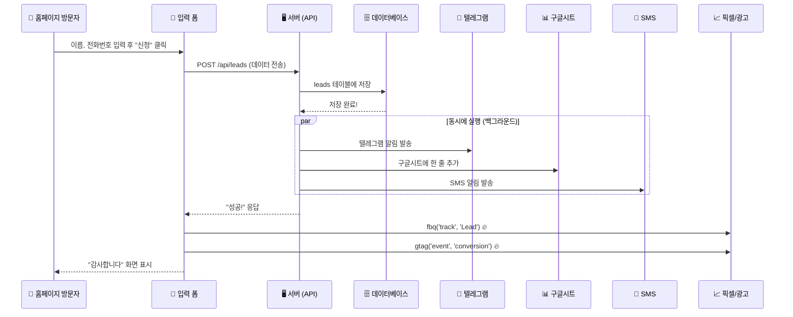

# 🏠 외부 홈페이지용 "미니 이지랜딩" 구현 계획

## 📌 한 줄 요약
> 다른 업체 홈페이지 하단에 **이지랜딩과 동일한 방식의 입력폼**을 넣고,  
> 전용 **관리자 페이지**에서 DB를 관리하고 싶다!

---

## 🎬 이지랜딩은 지금 어떻게 작동하나? (초등학생 버전)

### 전체 흐름 한눈에 보기



---

## 🔍 DB에 유입되면 서버(백엔드)에서 일어나는 일 — 아주 상세하게!

유저가 "신청하기" 버튼을 누르면, **서버에서는 이런 일들이 순서대로 일어나요**:

### STEP 1️⃣ — 데이터 받기
```
서버가 이런 데이터를 받아요:
{
  "page_id": "abc123",          ← 어떤 페이지에서 온 건지
  "fields": {                   ← 유저가 입력한 내용
    "이름": "홍길동",
    "전화번호": "010-1234-5678"
  },
  "source_url": "https://...",  ← 어디서 왔는지 (URL)
  "utm_source": "facebook",     ← 어떤 광고에서 왔는지
  "utm_medium": "cpc",
  "utm_campaign": "summer",
  "referrer": "https://...",    ← 이전에 어떤 사이트에 있었는지
  "tracking_id": "unique123"    ← 중복 방지용 고유번호
}
```

### STEP 2️⃣ — 유효성 검사
```
✅ page_id가 있나? → 없으면 "에러!" 하고 끝
✅ page_id로 pages 테이블을 조회해서 해당 페이지가 진짜 있는지 확인
✅ 해당 페이지의 주인(user_id)이 누구인지 알아냄
```

### STEP 3️⃣ — 중복 체크
```
🔍 같은 page_id + tracking_id 조합으로 이미 저장된 게 있나?
   → 있으면: "이미 저장된 거 있어요~" 하고 기존 데이터 돌려줌 (중복 저장 방지!)
   → 없으면: 다음 단계로 진행
```

### STEP 4️⃣ — DB에 저장 ⭐ (가장 중요!)
```sql
-- leads 테이블에 새 줄 추가!
INSERT INTO leads (
  page_id,        -- 'abc123'
  user_id,        -- 페이지 주인 ID
  fields,         -- {"이름": "홍길동", "전화번호": "010-1234-5678"}
  status,         -- 'new' (새로운 DB)
  source_url,     -- 유저가 접속한 URL
  utm_source,     -- 'facebook'
  utm_medium,     -- 'cpc'
  utm_campaign,   -- 'summer'
  utm_term,
  utm_content,
  referrer,       -- 이전 사이트
  tracking_id,    -- 중복방지용
  created_at      -- 지금 시각
)
```

### STEP 5️⃣ — 저장 성공 후, 알림 발사! 🚀 (동시에, 백그라운드에서)

> [!IMPORTANT]
> 이 단계가 핵심! DB 저장이 끝나자마자, **3가지를 동시에** 쏩니다.
> `Promise.allSettled`를 써서 **하나가 실패해도 나머지는 정상 작동**해요.

#### 5-A. 텔레그램 알림 📱
```
1. landing_pages 테이블에서 해당 페이지의 page_config를 가져옴
   → page_config.telegram 안에 설정이 들어있음
   
2. telegram.enabled = true 이면:
   → botToken, chatId를 꺼냄
   
3. 메시지를 만들어서 텔레그램 API로 전송
   → "🔔 새 DB가 들어왔습니다!
      페이지: OO업체 랜딩
      이름: 홍길동
      전화번호: 010-1234-5678"
```

#### 5-B. 구글시트 연동 📊
```
1. landing_pages 테이블에서 google_sheet_config를 가져옴
2. enabled = true 이면:
   → google_tokens로 OAuth 토큰 갱신 (만료됐으면)
   → Google Sheets API로 스프레드시트에 새 행 추가
```

#### 5-C. SMS/알림톡 💬
```
1. landing_pages.page_config.alimtalk에서 설정을 가져옴
2. 활성화 되어있으면:
   → Solapi 또는 Aligo API로 알림 발송
```

### STEP 6️⃣ — 유저에게 "성공!" 응답 보내기
```
서버 → 프론트엔드: { status: 201, data: { id: "새DB의ID", ... } }
```

> [!NOTE]
> **사실 프론트엔드는 이 응답을 기다리지도 않아요!**  
> 이지랜딩은 `keepalive: true` 옵션으로 API를 "Fire & Forget" 방식으로 쏴요.  
> 즉, API를 호출하자마자 바로 픽셀 터뜨리고, 쿠키 저장하고, 완료 화면을 보여줘요.  
> 서버 응답이 느려도 유저 경험에는 전혀 영향이 없는 구조!

---

## 🔥 픽셀은 언제 터지나?

```
페이지 처음 열었을 때:
  → fbq('track', 'PageView')     ← 페이지 조회 이벤트
  → gtag('config', 'AW-xxx')     ← 구글 페이지뷰

폼 제출할 때 (API 호출과 거의 동시에!):
  → fbq('track', 'CompleteRegistration')  ← 전환 이벤트 (페이스북)
  → gtag('event', 'conversion')           ← 전환 이벤트 (구글)
  → ttq.track('CompleteRegistration')     ← 틱톡
  → kakaoPixel.participation()            ← 카카오
```

> [!IMPORTANT]
> **중요한 포인트!** 이지랜딩에서 픽셀은 **API 응답을 기다리지 않아요!**  
> API 호출을 `fetch(..., { keepalive: true })` 로 쏘고 ("Fire & Forget"),  
> **바로 다음 줄에서 픽셀을 터뜨려요.**  
> 이렇게 하면 유저 입장에서 딜레이가 거의 없어요!

### 프론트엔드 전체 흐름 (코드 기준)

```
[유저가 제출 버튼 클릭]
      │
      ▼
[0] 미리보기 모드 체크 → 미리보기면 안내창 뜨고 끝
      │
      ▼
[1] 폼 유효성 검사 (빈칸, 전화번호 11자리 등)
    → 실패하면 에러 메시지 띄우고 끝
      │
      ▼
[2] 쿠키 중복 체크 (이미 신청했는지)
    → 쿠키 있으면 "이미 신청하셨습니다" 알림
      │
      ▼
[3] 데이터 묶기 (이름, 전화번호, UTM, 마케팅동의 등)
      │
      ▼
[4] API 호출 (Fire & Forget! 응답 안 기다림!)
    fetch('/api/leads', { keepalive: true })
      │
      ▼
[5] 픽셀 발사! 🔥 (API 응답 전에 바로!)
    fbq + gtag + ttq + kakao + daangn
      │
      ▼
[6] 쿠키 저장 (365일, 중복 방지용)
    폼 데이터 초기화
      │
      ▼
[7] 완료 액션
    → 리다이렉트 URL 있으면 이동
    → 없으면 팝업 메시지 표시
```

---

## 🗄️ DB 테이블 구조 (실제 코드 기준)

| 테이블 | 역할 | 핵심 컬럼 |
|--------|------|-----------|
| **leads** | 고객 DB 저장소 | `customer_name`, `customer_phone`, `form_data`(JSONB), `status`, `platform`, `manager`, `memo`, `ip_address`, `deleted_at`(소프트 삭제) |
| **landing_pages** | 페이지 + 모든 설정 | `slug`, `title`, `page_config`(JSONB: 픽셀/텔레그램/알림톡 설정 전부 여기!), `google_sheet_config`, `form_config`, `admin_config` |
| **plugin_purchases** | 유료 플러그인 구매 | `plugin_id`, `status`, `expires_at` |
| **profiles** | 사용자 계정 | `name`, `email`, `phone`, `is_admin` |
| **daily_stats** | 일별 유입 통계 | 유입수, 전환수, 날짜 |

> [!TIP]
> **핵심 포인트!** 이지랜딩은 텔레그램, 픽셀, 구글시트 등의 연동 설정을  
> 별도 테이블이 아니라 **`landing_pages.page_config` JSONB 컬럼 하나에 다 넣어요!**  
> 이렇게 하면 테이블 조인 없이 한 번에 읽을 수 있어서 빨라요.

---

## 🛠️ 외부 홈페이지에 적용하려면?

### 방법 1: 가장 간단한 방법 — API만 따로 만들기

외부 홈페이지는 이미 만들어져 있으니까, **백엔드(API + DB)만 새로 만들면 돼요.**

필요한 것:

| 구성요소 | 뭘 하는지 | 난이도 |
|----------|-----------|--------|
| **Supabase 프로젝트** | DB + 인증 | ⭐ 쉬움 |
| **leads 테이블** | DB 저장 | ⭐ 쉬움 |
| **settings 테이블** | 텔레그램/픽셀 설정 저장 | ⭐ 쉬움 |
| **API 1개** (`/api/leads` POST) | 폼 데이터 받아서 저장 + 알림 | ⭐⭐ 보통 |
| **관리자 페이지** | DB 보기 + 설정 변경 | ⭐⭐⭐ 어려움 |
| **홈페이지 폼에 JS 추가** | 폼 제출 시 API 호출 + 픽셀 | ⭐⭐ 보통 |

### 방법 2: 이지랜딩에 "외부 폼 연동" 기능 추가

이지랜딩 자체에 외부 폼에서 데이터를 받을 수 있는 API를 열어주는 방법.
이러면 이지랜딩 관리자 페이지에서 그대로 관리 가능!

---

## ❓ 결정이 필요한 사항

> [!IMPORTANT]
> 아래 질문들에 따라 구현 방향이 크게 달라져요.

1. **외부 홈페이지는 어떤 기술로 만들었나요?**
   - 순수 HTML/CSS/JS? Next.js? 워드프레스? 아임웹?
   - 이에 따라 폼 연동 방식이 달라져요

2. **관리자 페이지를 어디에 만들까요?**
   - **방법 A**: 이지랜딩 안에서 관리 (이지랜딩에 기능 추가)
   - **방법 B**: 별도의 간단한 관리자 페이지를 새로 만들기
   
3. **필요한 연동은?**
   - 텔레그램 알림? ✅/❌
   - 구글시트 연동? ✅/❌
   - SMS 알림? ✅/❌
   - 페이스북 픽셀? ✅/❌
   - 구글 광고 전환? ✅/❌

4. **관리자 페이지에서 뭘 할 수 있어야 하나요?**
   - DB 목록 보기?
   - 상태 변경 (new → contacted → converted)?
   - 메모 추가?
   - CSV 내보내기?
   - 텔레그램/픽셀 설정?

## Verification Plan

### 방향 결정 후
- 선택한 방법에 따라 구체적인 구현 계획을 다시 작성
- 필요한 테이블, API, 프론트엔드 코드를 상세 설계
